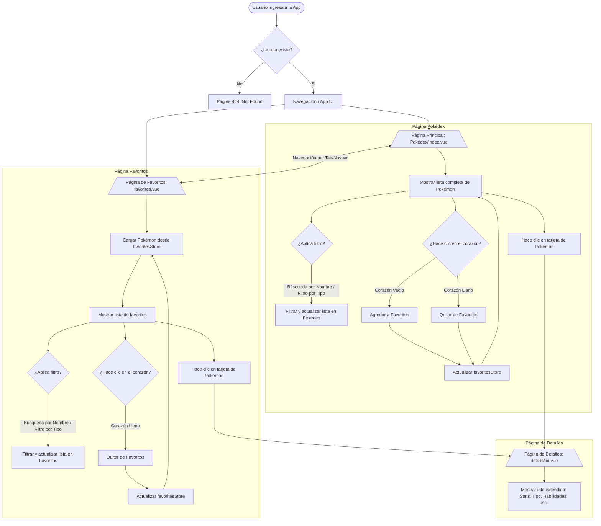

# 🧬 PokéDex Web App

Aplicación web moderna construida con **Nuxt 3** y **Vue 3** que explora el fascinante mundo de Pokémon a través de la **[PokeAPI](https://pokeapi.co/)**. Esta implementación sigue principios de arquitectura escalable e incorpora buenas prácticas de desarrollo frontend haciendo uso de Container/Presentational Pattern y Layered Architecture.

> 🤖 **Desarrollo asistido por IA**
>
> Este proyecto fue desarrollado haciendo uso de herramientas de IA, principalmente Claude Code, para asistir en la generación de código, la implementación de funcionalidades y la optimización del proceso de desarrollo, en línea con el enfoque AI-First solicitado en la vacante.

> 🌐 **Link de vercel**
>
> https://pokedexprojectvercel.vercel.app/

---

## 📦 Tabla de Contenidos

- 🔧 Requisitos
- 🚀 Instalación
- 🛠️ Tecnologías Utilizadas
- 📁 Estructura del Proyecto
- 🌿 Estructura de Ramas
- ✨ Principales Funcionalidades
- 📝 Decisiones Técnicas
- 🧩 Arquitectura y Patrones de Diseño
- 📊 Manejo de Estados y Errores
- 🧪 Pruebas Unitarias
- 📐 Diagrama de Componentes
- 👨‍💻 Guía para Desarrollador@s
- 🔮 Posibles Mejoras Futuras

---

## 🔧 Requisitos

Version de Node recomendada: **v26.5.0**

---

## 🚀 Instalación

```bash
# Clonar el repositorio
git clone https://github.com/AndresFilatCoder/pokedex_project.git

# Navegar al directorio del proyecto
cd pokedex_project

# Instalar dependencias
npm install

# Iniciar servidor de desarrollo
npm run dev
```

La aplicación queda disponible en `http://localhost:3000`.

**Scripts disponibles**

| Comando | Descripción |
| --- | --- |
| `npm run dev` | Servidor de desarrollo |
| `npm run build` | Compilación para producción |
| `npm run preview` | Previsualiza la compilación |
| `npm test` | Ejecuta las pruebas unitarias |
| `npm run test:watch` | Pruebas unitarias en modo observador |
| `npm run typecheck` | Verifica los tipos de todo el proyecto, incluidos los `.vue` |

---

## 🛠️ Tecnologías Utilizadas

**Nuxt 3**
Framework progresivo basado en Vue 3 que facilita el desarrollo de aplicaciones SSR, SSG e híbridas con estructura modular, configuración por convención y excelente rendimiento, perfecto para crear aplicaciones web modernas y escalables.

**Vue 3 (Composition API)**
Toda la lógica de componentes se escribe con `<script setup>` y Composition API, lo que permite extraer y reutilizar comportamiento mediante composables.

**TypeScript**
Lenguaje de tipado estático que mejora la mantenibilidad del código, previene errores en tiempo de desarrollo y facilita el trabajo colaborativo. El proyecto está tipado por completo, sin `any` ni `@ts-ignore`.

**Tailwind CSS v4**
Framework CSS utility-first que permite construir interfaces altamente personalizadas mediante clases atómicas de bajo nivel directamente en el HTML. En lugar de componentes prediseñados, ofrece bloques de construcción flexibles que generan un archivo final ligero y optimizado. Aquí se usa además su bloque `@theme` para definir la paleta de la aplicación y el color de cada tipo de Pokémon.

**NuxtUI**
Framework de componentes para Nuxt que ofrece una variedad de componentes predefinidos, como botones, inputs, modales y checkboxes. Permite una integración fácil y rápida en proyectos Nuxt.

**Iconify (Unicons)**
Librería que facilita la implementación de una gran variedad de iconos, los cuales se pueden personalizar en cuanto a color, tamaño, etc. El proyecto usa la colección `@iconify-json/uil`, instalada de forma local para no depender de la API remota de Iconify.

**Pinia + pinia-plugin-persistedstate**
Manejo del estado global con persistencia en `localStorage` para el onboarding y los Pokémon favoritos.

**Vitest**
Framework de pruebas unitarias, integrado con el entorno de Nuxt mediante `@nuxt/test-utils`.

---

## 📁 Estructura del Proyecto
```markdown
.
├── app                        # Código fuente principal de la aplicación
│   ├── assets                 # Estilos globales y recursos procesados por Nuxt
│   ├── components             # Componentes reutilizables de la interfaz
│   │   ├── common             # Estados compartidos: loader, error, vacío
│   │   ├── filters            # Barra de búsqueda, modal de tipos y resumen
│   │   ├── layout             # Navegación y cabeceras de página
│   │   ├── onboarding         # Pasos e indicador del onboarding
│   │   └── pokemon            # Cards, distintivos y ficha de detalle
│   ├── composables            # Lógica reutilizable mediante Composition API
│   ├── constants              # Rutas, tipos de Pokémon, iconos y textos fijos
│   ├── layouts                # Plantillas reutilizables para las páginas
│   ├── middleware             # Guardas de navegación del lado del cliente
│   ├── pages                  # Rutas y vistas de la aplicación
│   ├── plugins                # Plugins y configuraciones globales
│   ├── services               # Servicios encargados de la comunicación con la API
│   ├── stores                 # Estado global de la aplicación mediante Pinia
│   ├── types                  # Tipado TypeScript de la PokeAPI y de la interfaz
│   ├── utils                  # Funciones utilitarias auto-importadas
│   └── error.vue              # Página de error / 404
├── app.vue                    # Componente raíz de la aplicación
├── test                       # Pruebas unitarias con Vitest
├── eslint.config.mjs          # Configuración de ESLint
├── nuxt.config.ts             # Configuración principal de Nuxt
├── vitest.config.ts           # Configuración de Vitest
├── package-lock.json          # Versiones bloqueadas de las dependencias
├── package.json               # Dependencias y scripts del proyecto
├── public                     # Recursos públicos servidos sin procesamiento
├── server                     # Configuración y lógica del servidor de Nuxt (Nitro)
└── tsconfig.json              # Configuración de TypeScript
```

---

## 🌿 Estructura de Ramas

El repositorio trabaja con tres ramas, cada una con una responsabilidad distinta.

```
main ──────────────► Rama estable
  │
  └── dev ─────────► Rama de desarrollo
        │
        └── testing ► Rama de pruebas unitarias
```

| Rama | Propósito | Contenido |
| --- | --- | --- |
| **`main`** | Rama estable y punto de partida del repositorio. | Configuración inicial y recursos de identidad gráfica. |
| **`dev`** | Rama de desarrollo. Aquí se integró toda la aplicación, fase por fase. | Onboarding, navegación, listado, filtros, favoritos y detalle. |
| **`testing`** | Rama dedicada a las pruebas unitarias. Parte de `dev`. | Todo lo de `dev` más la configuración de Vitest y las pruebas. |

**Flujo de trabajo seguido**

- Cada fase del desarrollo se integró en `dev` con commits pequeños y descriptivos, uno por funcionalidad.
- Las pruebas unitarias se aislaron en `testing` para no mezclarlas con el código de la aplicación.
- `testing` parte del último commit de `dev`, así que traerla a `dev` es una fusión directa sin conflictos:

```bash
git checkout dev
git merge testing
```

> **Nota:** los scripts `npm test`, `npm run test:watch` y `npm run typecheck` solo están disponibles en la rama `testing`, ya que es donde vive la configuración de Vitest.

---

## ✨ Principales funcionalidades

- 👋 Onboarding de dos pasos para usuarios nuevos, con persistencia
- 🛡️ Middleware global que protege las rutas hasta completar el onboarding
- 📋 Listado completo de Pokémon con carga progresiva y scroll infinito
- 🔍 Búsqueda por nombre, sin debounce e insensible a mayúsculas y acentos
- 🏷️ Filtro por tipo mediante modal, con selección múltiple
- 🔗 Filtros combinables, contador de resultados y botón para limpiarlos
- ❤️ Favoritos persistidos con Pinia
- 📖 Vista de detalle con descripción, peso, altura, categoría, habilidad y género
- ⚔️ Cálculo de debilidades combinando las relaciones de daño de ambos tipos
- 🔊 Reproducción del sonido del Pokémon al abrir su detalle
- 🎨 Color dinámico por tipo de Pokémon en cards y ficha de detalle
- ⏳ Loaders y esqueletos de carga
- ⚠️ Manejo de errores con opción de reintentar
- 🚫 Página 404
- 📱 Diseño adaptado de móvil a escritorio

---

## 📝 Decisiones Técnicas

* **Uso de Nuxt 3:** Se eligió Nuxt por su arquitectura optimizada, integración automática con Vue 3, su sistema de auto-importaciones y su enrutado por convención. Esto permite una estructura clara y una mejor experiencia de desarrollo.

* **Uso de Tailwind CSS:** Se eligió Tailwind para acelerar el desarrollo de la interfaz. Además, se integró con NuxtUI para obtener componentes predefinidos y estilos preconfigurados para una integración rápida y fácil en proyectos Nuxt.

* **Un único color por tipo de Pokémon:** La paleta se extrajo directamente de los diseños. Cada tipo define un solo color base en `main.css` y el tono claro de las cards se deriva con `color-mix`, de modo que una card solo necesita el atributo `data-pokemon-type` para pintarse por completo.

* **Uso de Iconify:** Se implementó Iconify para incorporar iconos de forma sencilla y flexible. Se usa únicamente la colección Unicons instalada de forma local, y los iconos internos de NuxtUI se reasignaron a esa misma colección para no depender de peticiones remotas.

* **Carga progresiva del listado:** La PokeAPI devuelve más de 1.300 Pokémon y su índice no incluye tipos ni imágenes. Se trae el índice completo en una sola petición y los detalles se piden por tandas conforme el usuario avanza, guardándolos en caché para no repetirlos.

* **Filtros sobre el índice completo:** Los filtros se aplican sobre todos los Pokémon y no solo sobre los ya cargados, de modo que una búsqueda encuentra coincidencias aunque el usuario nunca haya llegado a ellas con el scroll.

* **Manejo de Estado:** La aplicación maneja los estados de carga, error y ausencia de resultados, con componentes de loader, error y estado vacío, para mejorar la experiencia del usuario.

* **Uso de Servicios:** Se implementó un servicio (`services/usePokemon.ts`) para abstraer la lógica de consumo de la API y mantener los componentes lo más limpios posible. Esto permite una separación clara de responsabilidades y facilita el testeo y mantenimiento del código.

* **Uso de Composables:** Se utilizaron composables (`useCustomFetch.ts`, `usePokemonList.ts`, `usePokemonDetail.ts`, `usePokemonTypes.ts`, `usePlayAudio`) para extraer lógica reutilizable y mantener los componentes enfocados en la presentación. Esta técnica permite mayor modularidad, facilidad de pruebas y legibilidad del código.

* **Uso de `useFetch()` implícito dentro de `useCustomFetch()` (Custom Fetching):** Todas las peticiones pasan por este composable, que centraliza la URL base y el manejo de errores.

* **Persistencia en `localStorage`:** El plugin de persistencia guarda en cookies por defecto, pero la lista de favoritos superaría el límite de una cookie y viajaría en cada petición, así que se configuró `localStorage`.

---

## 🧩 Arquitectura y Patrones de Diseño

**Layered Architecture**: El flujo de datos atraviesa capas con responsabilidades separadas.

```
Servicio (HTTP puro) → Composable (orquestación y estado) → Store (estado compartido) → Componente (presentación)
```

**Composables**: A través de los composables, se reutiliza y comparte lógica entre componentes sin duplicación de código.

**Separation of Concerns (SoC)**: Cada carpeta y archivo cumple un propósito específico. La lógica de red está separada de la lógica visual, que a su vez está separada de los tipos, estilos y utilidades.

**Presentational vs Container Components**: Los componentes están diseñados para diferenciar entre quienes manejan la lógica y quienes se encargan exclusivamente del renderizado. Las páginas orquestan la carga de datos y los componentes de `components/` reciben todo por props.

**Plugin Pattern**: Se usa para extender Nuxt con funcionalidades globales reutilizables como la configuración de SEO (`plugins/seo.global.ts`).

**Middleware Pattern**: `middleware/onboarding.global.ts` centraliza la guarda de navegación en lugar de repetir la comprobación en cada página.

---

## 📊 Manejo de Estados y Errores

* **useCustomFetch** y **try/catch** para capturar errores en llamadas a API.

* Visualización de estados: cargando, sin resultados, error y lista vacía.

* Un fallo al cargar una tanda intermedia del listado no borra lo ya cargado: el aviso aparece al final de la lista y permite reintentar solo esa tanda.

* Página para manejo de errores como 404 Not Found.

---

## 🧪 Pruebas Unitarias

Las pruebas se ejecutan con **Vitest** sobre el entorno de Nuxt (`@nuxt/test-utils`), lo que permite que las importaciones automáticas del proyecto funcionen dentro de los tests sin modificar el código de la aplicación.

**Alcance**

Son pruebas unitarias básicas centradas en el *happy path* de las funcionalidades principales. No pretenden cubrir la implementación completa.

| Archivo | Qué cubre |
| --- | --- |
| `utils/effectiveness.spec.ts` | Cálculo de debilidades, incluido un Pokémon de dos tipos |
| `utils/pokemon.spec.ts` | Formateadores, conversión de unidades y modelo de la card |
| `utils/filters.spec.ts` | Búsqueda por nombre, filtro por tipo y ambos combinados |
| `stores/useFavoritesStore.spec.ts` | Añadir, eliminar, alternar y evitar duplicados |
| `stores/useFiltersStore.spec.ts` | Filtros activos y limpieza conjunta |
| `stores/useOnboardingStore.spec.ts` | Marca de onboarding completado |
| `components/PokemonFavoriteButton.spec.ts` | Pulsar el corazón marca y desmarca en el store |

**Ejecución**

```bash
# Ejecutar todas las pruebas una vez
npm test

# Modo observador
npm run test:watch

# Verificación de tipos (incluye los archivos .vue y las pruebas)
npm run typecheck
```

**Ubicación**

Las pruebas viven en `test/nuxt/`, que es la ruta que Nuxt incluye por convención para pruebas que corren en su entorno. Gracias a ello quedan cubiertas también por `npm run typecheck`.

> Las pruebas y su configuración están en la rama **`testing`**.

---

## 📐 Diagrama de Componentes



---

## 👨‍💻 Guía para Desarrollador@s

Esta guía está diseñada para facilitar la comprensión, extensión y mantenimiento del proyecto por parte de nuevos desarrolladores.

**Estructura Clave del Proyecto**

📁 **pages/** - Define las vistas principales de la app.

📁 **components/** - Contiene componentes visuales reutilizables, agrupados por dominio.

📁 **layouts/** - Define la estructura base de las páginas (`default` con navegación y `blank` para el onboarding).

📁 **composables/** - Lógica reutilizable desacoplada de la vista, usando Composition API.

📁 **middleware/** - Guardas de navegación globales.

📁 **services/** - Lógica de acceso a API's y retorno de datos.

📁 **stores/** - Estado global con Pinia y su persistencia.

📁 **types/** - Tipado TypeScript para todas las entidades utilizadas.

📁 **constants/** - Valores fijos: rutas, tipos de Pokémon, iconos y textos.

📁 **utils/** - Funciones utilitarias auto-importadas, como formateo, filtros y cálculo de debilidades.

📁 **plugins/** - Funciones globales para Vue/Nuxt como configuraciones de SEO.

📁 **assets/** - Estilos globales (CSS) y definición de la paleta.

📁 **public/** - Archivos estáticos publicos como imágenes, gifs y diseños de referencia.

---

🧩 **Tener en cuenta antes de añadir una Nueva Funcionalidad**

1. Todos los llamados a API deben hacerse usando un Servicio en **services/**, que a su vez usa **useCustomFetch**.

2. Definir Tipos en **types/** si se utilizan nuevas estructuras de datos.

3. Crear un Composable si se necesita lógica reutilizable o manejo de estado de carga y error.

4. Construir uno o más Componentes si se necesita representación visual (Separation of Concerns).

5. Agregar una nueva Página en **pages/** si se requiere una ruta específica, junto con su `useSeoMeta`.

6. Si la funcionalidad necesita un color por tipo de Pokémon, basta con aplicar el atributo `data-pokemon-type`.

7. Agregar Pruebas unitarias en **test/nuxt/** relacionadas con el nuevo comportamiento, en la rama `testing`.

---

## 🔮 Posibles Mejoras Futuras

🔧 Optimización de rendimiento: Implementar virtualización del listado para no mantener miles de nodos en el DOM.

🔧 Carga de imágenes y multimedia en general: Solicitar recursos directamente de S3 para liberar peso y optimizar aún más la carga de recursos estáticos como imagenes y gifs.

🔧 Ampliar las funcionalidades: Integrar el sistema de favoritos directamente con el backend en vez de guardar los datos en el store de Pinia.

🔧 Completar las secciones pendientes: Las páginas de Regiones y Perfil muestran actualmente una interfaz de "muy pronto disponible".

🔧 Siluetas decorativas por tipo: Las cards y la ficha de detalle usan un degradado en lugar de la silueta del diseño (hoja, llama, gota…), pendiente de los recursos gráficos.

🔧 Ampliar la cobertura de pruebas: Añadir pruebas de los composables de carga y de los componentes de filtrado.
